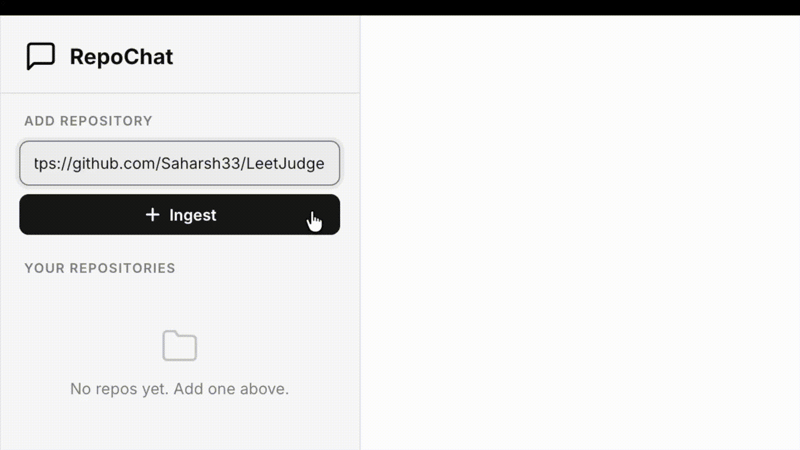
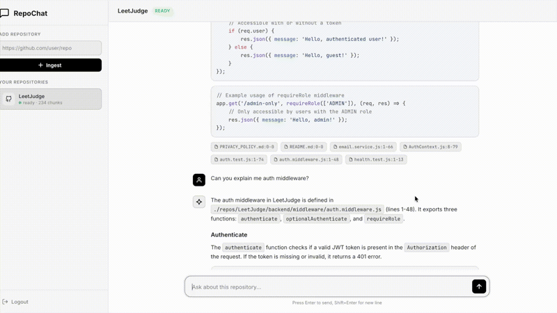
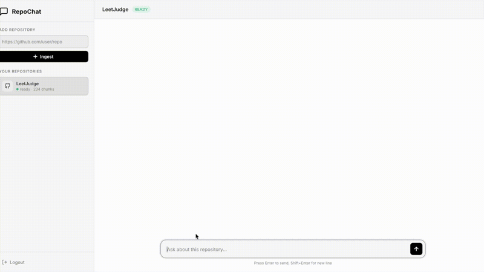
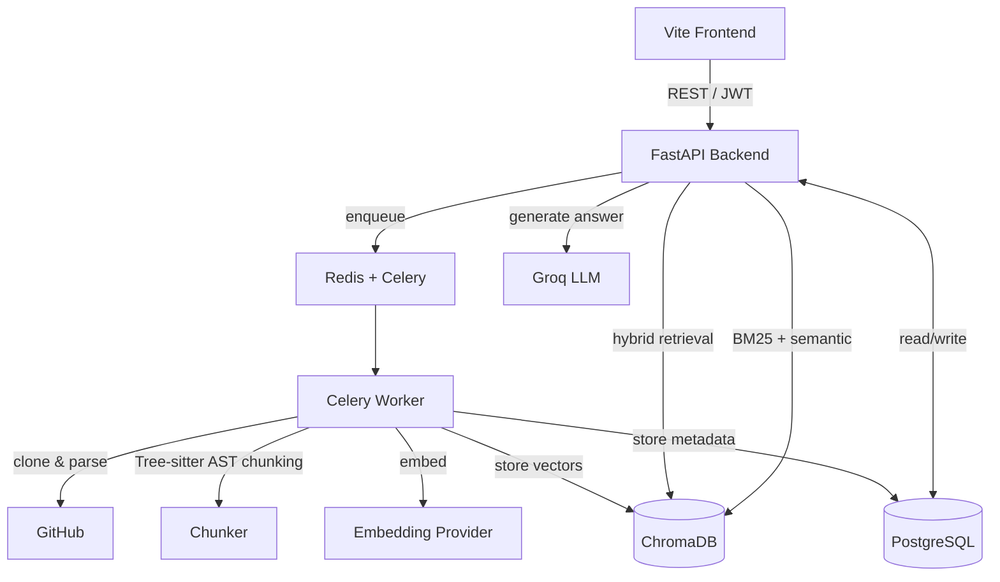

<div align="center">

# RepoChat

A RAG-powered AI chatbot that lets you have conversations with any GitHub repository. Paste a repo URL, and it gets cloned, parsed, chunked, embedded, and indexed — then you can ask questions about the codebase and get grounded, cited answers.


</div>

---

## What it does

You paste a GitHub URL. RepoChat clones it, walks the file tree, parses code into semantic chunks using Tree-sitter, generates embeddings, and stores everything in ChromaDB. Then you chat with it.

**Ingestion Pipeline**: The repo is cloned, walked for supported files (`.py`, `.js`, `.ts`, `.go`, `.rs`, `.java`, `.cpp`, `.c`, `.md`), and each file is parsed using Tree-sitter into AST-aware chunks — functions, classes, and methods get their own chunks with preserved signatures, not arbitrary line splits. A repository overview chunk is also generated that maps every file to its key functions/classes, giving the LLM a structural understanding of the entire codebase at a glance.

**Retrieval & Conversation Pipeline (The "Talk" Algorithm)**:
When a query is received, it goes through a multi-step pipeline:
1. **Query Rewriting & Intent Routing**: The user's query and the last few messages of chat history are sent to a Groq LLaMA model to rewrite the query into a standalone sentence (e.g., resolving pronouns like "it"). The intent is also classified into `overview`, `architecture`, `implementation`, or `casual`.
2. **Hybrid Retrieval**: For technical intents, the system queries ChromaDB. It combines semantic vector similarity (finding code with similar meaning), BM25 keyword scoring (finding exact variable/function names), and filename matching. The results are scored and weighted (Semantic: 0.55, BM25: 0.25, Filename: 0.20) to ensure high relevance.
3. **Context Trimming & Injection**: The highest-scoring chunks are gathered, respecting a strict token budget. An auto-generated `repository_structure` chunk is always injected for `overview` queries to give the model a global map of the project.
4. **LLM Generation**: The trimmed context, chat history, and system prompts are sent to Groq (LLaMA 3) to generate the final response.

**Ingestion Lifecycle**:
- `pending`: Repo added, waiting for worker.
- `indexing`: Worker is cloning, parsing, chunking, and embedding.
- `ready`: Indexed and available for chat.
- `error`: Something failed (message stored for debugging).

## Deployment Status
Currently, RepoChat is **not deployed** to a live production environment. The application relies on a Dockerized infrastructure (PostgreSQL, Redis, ChromaDB, Celery Workers, FastAPI, Vite) and is intended to be run locally. Because the background workers need to clone arbitrary GitHub repositories and parse them, running this locally ensures isolated and secure execution.

The embedding provider is built behind a strategy interface — `SentenceTransformer` (local, heavy) and `Gemini API` (lightweight, free tier) are both implemented. Switching is a one-line `.env` change.

## Tech Stack

| Layer | Technology |
|---|---|
| Frontend | Vanilla JS, Vite 8, Marked, Highlight.js |
| Backend | Python, FastAPI, SQLAlchemy |
| Database | PostgreSQL |
| Vector Store | ChromaDB (persistent) |
| Queue | Redis, Celery |
| Parsing | Tree-sitter (AST-aware chunking) |
| Embeddings | SentenceTransformer / Gemini API (strategy pattern) |
| LLM | Groq (Llama) |
| Auth | JWT, Google OAuth |

The embedding provider is built behind a strategy interface, so the underlying provider (e.g. SentenceTransformer → Gemini API → OpenAI) is swappable without touching the rest of the codebase.

---

## Core Features

### Chat with Any GitHub Repository
Paste a GitHub URL, wait for ingestion, and start asking questions. Answers are grounded in the actual codebase with file path and line number citations. Responses stream token-by-token via SSE.

<div align="center">
  
</div>

### Cited Sources with Expandable Chunks
Every answer includes the exact code chunks that were used as context. Click to expand and see the raw source code the LLM was grounded on — full transparency, no hallucination.

<div align="center">
  
</div>

### Smart Query Routing
Queries are automatically classified and routed to different retrieval strategies:
- **Overview/Architecture** → diverse retrieval across many files (max 2 chunks per file)
- **Implementation** → focused retrieval on the most relevant code
- **Casual** → no retrieval needed, direct conversational response

<div align="center">
  
</div>

### More Features
- **AST-Aware Chunking:** Tree-sitter parses code into functions, classes, and methods — not arbitrary line splits. Each chunk preserves its signature.
- **Hybrid Retrieval:** Combines semantic similarity, BM25 keyword matching, and filename boosting for accurate results.
- **Repo Overview Chunk:** Auto-generated structural map showing which file defines which functions/classes, injected during ingestion.
- **Streaming Responses:** Token-by-token SSE streaming with markdown rendering and syntax highlighting.
- **Chat History:** Persistent message history with conversation context for follow-up questions.
- **Auth:** JWT-based authentication with Google OAuth support.

---

## Architecture

Four independently scalable pieces: the API, the queue, the worker, and the datastores.



## Getting Started

### Docker Compose (recommended)

```bash
cp .env.example .env
# Fill in your GROQ_API_KEY
docker compose up --build
```

This starts PostgreSQL, Redis, the FastAPI backend, Celery worker, and the Vite frontend, with hot-reload on the backend via volume mounts.

| Service | URL |
|---|---|
| Frontend | `http://localhost:3000` |
| Backend API | `http://localhost:8000` |

### Environment Variables

```env
GROQ_API_KEY=your_groq_key          # Required — LLM for chat
JWT_SECRET_KEY=your_secret           # Required — auth

# Embedding provider: "sentence_transformer" (local) or "gemini" (API)
EMBEDDING_PROVIDER=sentence_transformer
EMBEDDING_API_KEY=                   # Required only if using gemini

# Optional — Google OAuth
GOOGLE_CLIENT_ID=
GOOGLE_CLIENT_SECRET=
GOOGLE_REDIRECT_URI=http://localhost:8000/api/auth/google/callback
```

## Project Structure

```text
RepoChat/
├── backend/
│   ├── main.py                  # FastAPI entry point
│   ├── database.py              # SQLAlchemy engine & sessions
│   ├── models.py                # Repo, Chunk, Message, User
│   ├── routes/
│   │   ├── repos.py             # Repo CRUD, chat, streaming
│   │   └── auth.py              # JWT, Google OAuth, registration
│   └── services/
│       ├── chat_service.py      # Retrieval → LLM pipeline
│       ├── repo_service.py      # Repo creation logic
│       └── auth_service.py      # Token generation & validation
├── worker/
│   ├── celery_app.py            # Celery configuration
│   ├── tasks.py                 # Celery task definitions
│   ├── ingestion/
│   │   ├── ingest.py            # Full ingestion pipeline
│   │   ├── repo_loader.py       # Git clone
│   │   ├── file_walker.py       # File discovery & filtering
│   │   └── chunker.py           # Tree-sitter AST chunking
│   ├── embeddings/
│   │   ├── embedder.py          # Public embedding API
│   │   └── provider.py          # Strategy pattern providers
│   └── deletion/
│       └── delete.py            # Repo cleanup
├── retrieval/
│   ├── vector_store.py          # ChromaDB storage & hybrid retrieval
│   ├── chroma_client.py         # ChromaDB client singleton
│   └── schema.py                # Chunk & retrieval schemas
├── llm/
│   ├── groq_client.py           # Groq API client
│   ├── prompts.py               # System prompts
│   └── query_pipeline.py        # Query rewriting & intent routing
├── frontend/
│   └── src/
│       ├── app.js               # Main application logic
│       ├── api.js               # API client with JWT handling
│       ├── main.js              # Entry point & auth flow
│       └── style.css            # UI styling
├── docker-compose.yml
├── Dockerfile
└── requirements.txt
```
